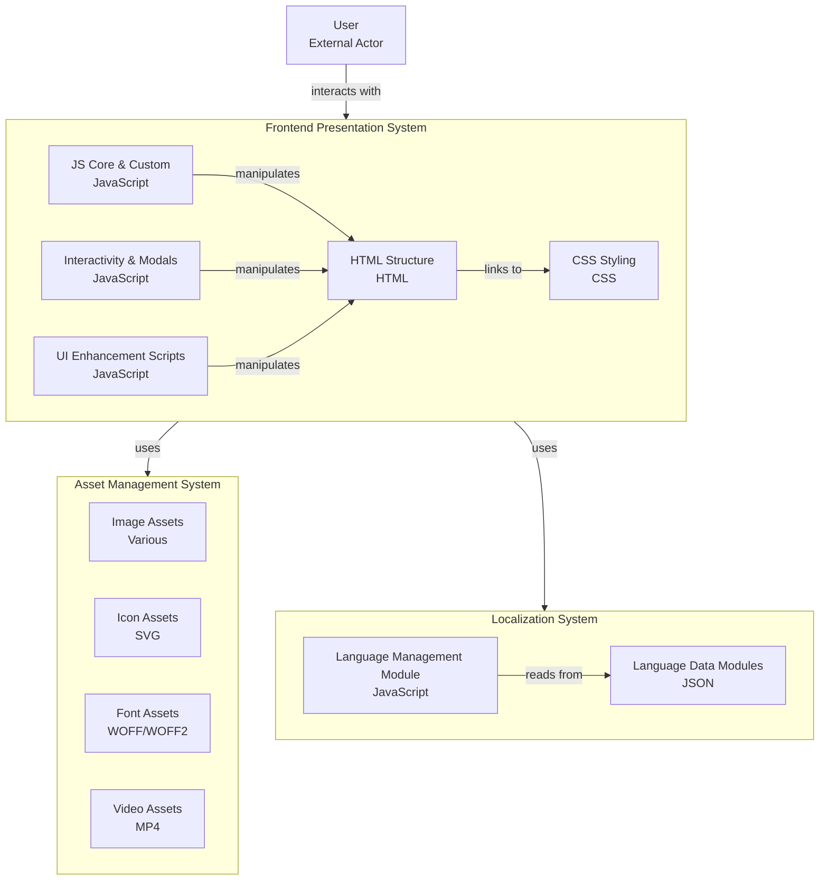

# 🚀 Portafolio Personal

Un portafolio web moderno y multiidioma que presenta proyectos y habilidades profesionales de manera interactiva.

## 📋 Sobre este Repositorio

Este repositorio documenta la arquitectura y estructura técnica de mi portafolio personal. No incluye el código fuente completo, ya que el proyecto está protegido por derechos de autor.

**Para ver el proyecto funcionando, visita**: **[tu-dominio.com](https://shinradev.site)**

## 🏗️ Arquitectura del Sistema



### Descripción de Componentes

**🗂️ Asset Management System**: Gestiona todos los recursos multimedia (imágenes, iconos SVG, fuentes web y videos) de forma centralizada para optimizar la carga y mantenimiento.

**🌍 Localization System**: Maneja el soporte multiidioma mediante archivos JSON con traducciones y un módulo JavaScript que controla el cambio dinámico de idiomas.

**🎨 Frontend Presentation System**: Sistema principal de presentación que incluye la estructura HTML, estilos CSS, lógica JavaScript core, sistema de modales interactivos y mejoras de UI.

## 📁 Gestión de Archivos

```
portfolio/
├── index.html              # Página principal
├── assets/                 # Todos los recursos multimedia
│   ├── images/            # Fotografías y gráficos
│   ├── icons/             # Iconos SVG
│   ├── fonts/             # Fuentes WOFF/WOFF2
│   └── videos/            # Videos MP4
├── css/                   # Estilos del sitio
│   ├── main.css          # Estilos principales
│   └── responsive.css    # Diseño responsivo
├── js/                    # Scripts JavaScript
│   ├── core.js           # Funcionalidad principal
│   ├── modals.js         # Sistema de modales
│   └── ui-enhancements.js # Mejoras de interfaz
├── locales/               # Sistema multiidioma
│   ├── es.json           # Textos en español
│   ├── en.json           # Textos en inglés
│   └── lang-manager.js   # Gestor de idiomas
└── README.md
```

### Organización por Sistema

- **Assets (Sistema 1)**: Todos los archivos multimedia están organizados por tipo en la carpeta `assets/`
- **Localization (Sistema 2)**: Los archivos de idiomas JSON y el gestor están en `locales/`
- **Frontend (Sistema 3)**: Los archivos HTML, CSS y JS están separados por funcionalidad específica

## 🌐 Ver el Proyecto

Este portafolio está disponible en línea en: **[tu-dominio.com](https://shinradev.site)**

> **Nota**: Este repositorio es solo para mostrar la arquitectura y documentación del proyecto. El código fuente está protegido por derechos de autor y no está disponible para clonación.

## 💻 Tecnologías

- **Frontend**: HTML5, CSS3, JavaScript ES6+
- **Activos**: Imágenes optimizadas, SVG, WOFF2, MP4
- **Localización**: JSON + JavaScript
- **Arquitectura**: Modular y escalable

---

📄 **Este proyecto está protegido por derechos de autor** | 🌐 **Ver en vivo**: [shinradev.site](https://shinradev.site)